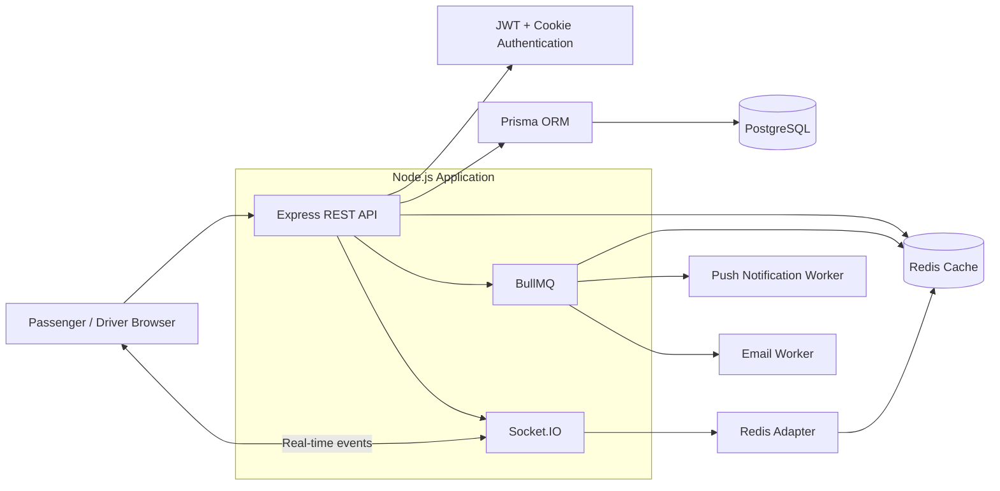
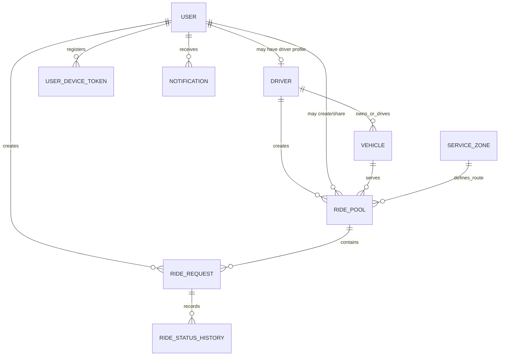
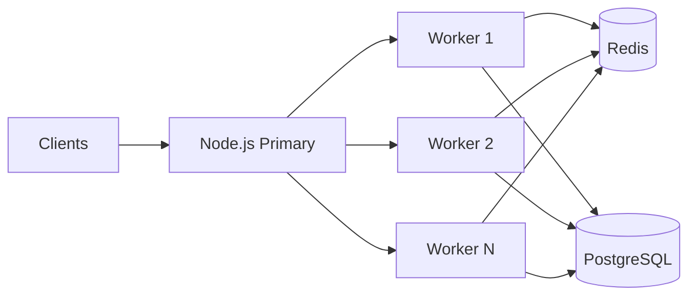
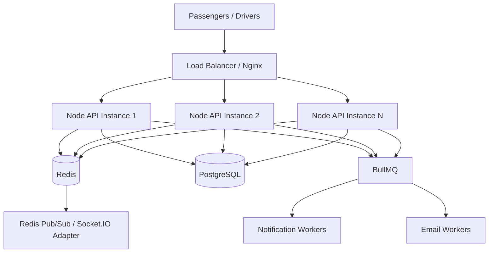

# RST-Tesla

> Share the next seat with others.

RST-Tesla is a ride-pooling MVP for Dhaka. It allows both passengers and drivers to create shared ride opportunities instead of treating pooling as a driver-only workflow.

A passenger can request a fresh ride and make it shareable so that compatible passengers travelling along the same road/corridor can reserve available seats. A driver can also create a ride pool for a planned route - for example, Mirpur 1 to Mirpur 10 - and passengers whose pickup and destination fall along that supported corridor can request a seat.

The project focuses on ride lifecycle correctness, seat-capacity consistency, real-time updates, understandable fare calculation, and an architecture that can evolve if the MVP grows.

## Table of Contents

- [Problem](#problem)
- [Core Features](#core-features)
- [Ride Pooling Rules](#ride-pooling-rules)
- [Ride Lifecycle](#ride-lifecycle)
- [Fare Model](#fare-model)
- [Architecture](#architecture)
- [Database Design](#database-design)
- [Concurrency and Seat Capacity](#concurrency-and-seat-capacity)
- [Real-Time Updates and Background Jobs](#real-time-updates-and-background-jobs)
- [Tech Stack and Decisions](#tech-stack-and-decisions)
- [Project Structure](#project-structure)
- [Environment Variables](#environment-variables)
- [Local Setup](#local-setup)
- [Docker](#docker)
- [Migrations and Seed Data](#migrations-and-seed-data)
- [API Overview](#api-overview)
- [Testing](#testing)
- [Demo Credentials](#demo-credentials)
- [Screenshots](#screenshots)
- [Deployment](#deployment)
- [Key Trade-offs and Limitations](#key-trade-offs-and-limitations)
- [If Oi Tesla Goes Viral](#if-oi-tesla-goes-viral)
- [AI Usage](#ai-usage)
- [Git Workflow](#git-workflow)
- [Demo Video](#demo-video)

## Problem

Dhaka commuters may travel through overlapping sections of the same road while paying for separate rides. RST-Tesla explores whether compatible passengers can share available vehicle seats while keeping each passenger's ride, fare, and status clear.

The system has three main concepts:

- **Passenger** - requests a ride or reserves a seat in a compatible pool.
- **Driver / Vehicle** - serves rides and can publish a planned route as a pool.
- **Ride Pool** - groups compatible ride requests without exceeding vehicle capacity.

The MVP deliberately uses predefined service areas/routes instead of attempting to rebuild a production mapping and routing platform.

## Core Features

### Passenger

- Authenticate using JWT-based authentication.
- Request a ride.
- Convert an eligible fresh ride into a shareable ride pool.
- Find/join compatible pools along supported routes.
- Reserve seats subject to vehicle capacity.
- Receive immediate UI updates when a driver accepts or cancels a request.
- Track the ride through its lifecycle.
- Pay by cash.

### Driver

- Authenticate as a driver.
- Create a ride pool for a planned route.
- Example: create a pool from **Mirpur 1 -> Mirpur 10**.
- Receive passenger seat/ride requests for compatible sections of the route.
- Accept a passenger request when capacity is available.
- Progress the ride through arrival, start, completion, or cancellation.

### Pooling

Pooling can begin from either side:

1. **Passenger-created pool:** a passenger creates a fresh ride and enables sharing. Other compatible passengers may reserve available seats.
2. **Driver-created pool:** a driver publishes a planned route and passengers travelling along that corridor may request seats.

This two-way model is an intentional extension of the basic ride-pooling flow.

## Ride Pooling Rules

The MVP uses predefined service zones/corridors rather than full geospatial routing.

Example:

- Passenger 1: `Mirpur 1 -> Mirpur 10`
- Passenger 2: `Mirpur 2 -> Mirpur 10`

If Mirpur 1, Mirpur 2, and Mirpur 10 are configured as points on the same supported road/corridor and Passenger 2's trip lies within the active pool route, Passenger 2 is eligible to request a seat.

This rule is intentionally simple and deterministic for the MVP. It avoids unnecessary dependency on a paid or complex map/routing API while keeping matching behavior testable.

## Ride Lifecycle

```text
REQUESTED
   |
   v
MATCHED / ACCEPTED
   |
   v
DRIVER_ARRIVED
   |
   v
STARTED
   |
   v
COMPLETED
```

A ride may transition to `CANCELLED` when cancellation is valid.

Ride state changes are recorded so the system can retain a history of what happened to a request.

## Fare Model

The MVP uses an understandable fare model:

```text
passengerFare = baseFare + distanceOrZoneCharge - poolingDiscount
```

Payment method:

```text
Cash
```

The exact configured fare constants and the representation used for monetary values should be documented here once finalized.


## Architecture

### Current MVP Architecture



The backend is implemented with **Express + TypeScript + REST**. PostgreSQL stores persistent application data and Prisma provides database access. Redis is used for caching. Socket.IO handles immediate client updates, while BullMQ is used for asynchronous work such as push notifications and email.

The application can use Node.js clustering so multiple workers can utilize server CPU cores. The Socket.IO Redis adapter supports communication between those workers.

## Database Design

Current main models/tables:

- `User`
- `AuthRateLimit`
- `Driver`
- `Vehicle`
- `ServiceZone`
- `RidePool`
- `RideRequest`
- `RideStatusHistory`
- `UserDeviceToken`
- `Notification`

### Conceptual ERD



This is a conceptual README diagram based on the current model list. The Prisma schema remains the source of truth for exact fields, foreign keys, cardinalities, indexes, and constraints.

## Concurrency and Seat Capacity

Vehicle capacity is calculated using the vehicle's total seats and already reserved/accepted seats.

A critical race condition occurs when a pool has only one seat remaining and two passengers request it at nearly the same time. Both clients may initially observe one available seat.

RST-Tesla does **not** rely only on what the clients saw. The driver decides which request to accept, and the acceptance/capacity update is performed inside a **Prisma transaction** so the capacity decision and database changes are handled atomically.

The important invariant is:

```text
reserved / accepted seats <= vehicle capacity
```

Concurrency behavior should be covered by an integration test that submits competing requests and verifies that the final accepted seat count never exceeds capacity.

## Real-Time Updates and Background Jobs

### Socket.IO

Socket.IO is used for events that should immediately update the connected user's UI, such as:

- driver accepts a ride request;
- driver cancels/rejects a request;
- relevant ride state changes.

### Redis

Redis currently provides caching and supports the Socket.IO Redis adapter when multiple Node workers are running.

### BullMQ

BullMQ handles asynchronous/durable jobs, including:

- push notifications;
- email delivery.

A key design decision was **not** to use plain Redis Pub/Sub as the notification delivery mechanism. Pub/Sub is useful for real-time communication between active processes, but a subscriber that is offline does not receive messages published while it is disconnected.

For user-facing notification work that should survive temporary disconnection or worker failure, the MVP instead uses BullMQ jobs. Redis Pub/Sub remains useful later for cross-server real-time Socket.IO communication, while durable work belongs in a queue.

## Tech Stack and Decisions

| Layer | Choice | Why |
| --- | --- | --- |
| Backend | Express + TypeScript | Small, explicit REST backend with TypeScript safety without introducing a heavier framework for the MVP. |
| API | REST | Fits resource-oriented ride, pool, driver, and request operations and keeps the client/server contract straightforward. |
| Database | PostgreSQL | Pooling, users, vehicles, capacity, lifecycle history, and requests are relational and benefit from transactions and constraints. |
| ORM | Prisma | Chosen primarily for a human-readable schema/API and maintainable TypeScript database access. |
| Authentication | JWT + cookies | Supports authenticated passenger/driver requests while allowing role/ownership checks in the API. |
| Cache | Redis | Fast shared cache and infrastructure that can also support multi-worker/multi-server coordination. |
| Real-time | Socket.IO | Pushes ride acceptance/cancellation/status changes to connected clients immediately. |
| Async jobs | BullMQ | Provides queued processing for push notifications and email instead of relying on ephemeral Pub/Sub delivery. |
| Payment | Cash | Keeps payment outside the critical engineering scope of the MVP. |

### When would these choices change?

The goal is not to introduce infrastructure simply because the system *might* become large. Components should be replaced or added when a measured problem requires them.

For example, a single Node deployment can evolve to multiple application servers behind a load balancer. Redis can coordinate real-time events across instances. Additional queue/stream infrastructure becomes justified when independent services and event consumers appear.


The names above are placeholders until verified against the repository.

## Local Setup

### Prerequisites

- Node.js
- npm
- PostgreSQL when running outside Docker
- Redis when running outside Docker
- Docker + Docker Compose for the containerized setup

### Install dependencies

```bash
npm install
```

Additional frontend/backend workspace commands should be added here if the repository uses separate packages.

## Docker

Start the containerized application with:

```bash
docker compose up -d
```

To inspect services:

```bash
docker compose ps
```

## API Overview

The backend exposes a REST API through Express.

Major resource areas include:

- authentication;
- passengers/users;
- drivers;
- vehicles;
- service zones;
- ride pools;
- ride requests;
- ride lifecycle/status history;
- notifications.


## Testing

High-value tests for this project should focus on business invariants rather than chasing a coverage percentage:

- vehicle capacity cannot be exceeded;
- two competing requests cannot both claim the final seat;
- invalid ride state transitions are rejected;
- compatible routes can join a pool;
- incompatible routes cannot join a pool;
- pooled fare calculations are correct;
- one user cannot modify another user's ride;
- cancellation rules are enforced;
- authentication and role/ownership checks work correctly.


## Screenshots

> 1. passenger ride request;
> 2. passenger-created shareable pool;
> 3. driver-created pool;
> 4. compatible seat reservation;
> 5. driver acceptance and real-time passenger UI update;
> 6. ride lifecycle/history.


### Predefined route matching

The MVP uses configured service zones/corridors rather than real map routing. This keeps matching deterministic and testable but is not sufficient for city-wide production matching.

### Cash-only payment

Cash avoids introducing a real payment gateway into the MVP. A production system would need a durable payment workflow, reconciliation, retry/idempotency rules, and stronger audit requirements.

### Queue before Pub/Sub for notifications

Using BullMQ adds more structure than directly publishing a notification event, but it avoids making offline delivery depend on an ephemeral subscriber connection.

### Monolith first

The application can remain a modular Node.js application while the domain and traffic are still small. Splitting the MVP into microservices would increase deployment, observability, data-consistency, and debugging complexity without a demonstrated requirement.

## If Oi Tesla Goes Viral

The MVP should not pretend to already be an architecture for one million passengers and 100,000 drivers. The scaling strategy is to evolve the current design as bottlenecks appear.

### Stage 1 - Use the current server properly

Node.js clustering can use multiple CPU cores on the current machine.



The Socket.IO Redis adapter lets events be coordinated between Node workers rather than assuming every socket is connected to the same process.

### Stage 2 - Add multiple application servers

When vertical scaling is no longer enough, place multiple stateless application instances behind a load balancer such as Nginx.



At this stage:

- application servers can scale horizontally;
- the load balancer distributes incoming API traffic;
- Redis provides shared cache/state needed across instances;
- the Socket.IO Redis adapter allows real-time events to reach clients connected to different instances;
- BullMQ workers can scale independently from HTTP servers.

### Stage 3 - Introduce event infrastructure only when needed

BullMQ remains appropriate for background work such as notifications and email.

If the system later grows into multiple independent services with several consumers of the same events, the event architecture can evolve. One possible progression is to use **Redis Streams together with BullMQ**, rather than treating plain Pub/Sub as a durable queue.

Redis Pub/Sub can still serve ephemeral cross-server real-time communication, such as propagating Socket.IO events. Durable work should use a mechanism that can be retried and processed after temporary failures.

### Real-time driver/passenger communication

A future driver/passenger chat feature would use the existing real-time foundation. Once multiple application servers exist, socket events must be propagated across instances through the Redis adapter/Pub/Sub layer.

### Database growth

PostgreSQL remains a reasonable relational source of truth because rides, capacity, users, vehicles, requests, and lifecycle transitions require strong consistency.

At larger scale the database strategy should be driven by measurements. Likely areas to investigate include:

- indexes around active pools, service zones, driver IDs, user IDs, and ride statuses;
- connection pooling;
- read replicas for read-heavy history/reporting traffic;
- partitioning large ride/history tables when their size justifies it;
- careful transaction boundaries around seat allocation;
- monitoring slow queries and lock contention.

These are scaling directions, not claims about features already implemented in the MVP.

### From fixed zones to geospatial matching

The current Mirpur corridor rule is deliberately simple. At city scale, fixed-area matching would become too coarse.

A production evolution would replace or augment it with geospatial data and route-aware matching. Candidate improvements include storing coordinates/geospatial indexes, searching for nearby vehicles and compatible pickup/drop-off points, and evaluating route overlap instead of only comparing configured zones.

The exact geospatial technology should be selected after the matching requirements are known rather than added to the MVP only for architectural appearance.

### Capacity under heavy contention

At higher traffic, seat allocation must remain a database-backed consistency operation. Application cache values cannot be the final authority for whether a seat exists.

The system should preserve an atomic capacity check/update and make acceptance operations idempotent so retries cannot allocate the same logical request twice. Lock contention and transaction latency should be measured as traffic grows.

### Reliability and observability

A production-scale version should progressively add:

- structured application logs;
- metrics and dashboards;
- distributed tracing when requests cross services;
- queue failure/dead-letter monitoring;
- retry policies with backoff;
- API rate limiting;
- idempotency for retryable state-changing operations;
- database backups and recovery procedures;
- secret management;
- health/readiness checks;
- alerts for elevated errors, latency, queue backlog, and database contention.

The principle is to add each mechanism because a concrete reliability or scale requirement exists, not to make the architecture diagram larger.

## AI Usage

AI was used as an engineering tool, while implementation decisions remain the developer's responsibility.

### Tools

- **OpenSpec** - used for planning and structuring implementation work.
- **Codex** - used to assist with code generation.

### Accepted AI assistance

AI-generated implementation assistance was used where the generated code matched the intended architecture and could be understood, reviewed, and modified by the developer.

### Rejected / changed suggestion

An AI suggestion was to use **Redis Pub/Sub for notification delivery**.

That suggestion was changed. Pub/Sub is ephemeral: if the relevant consumer/user is offline when an event is published, that event is not inherently retained for later processing. For notification work that should survive temporary disconnection and support asynchronous processing, **BullMQ** was selected instead.

Redis Pub/Sub remains a possible fit for cross-server real-time communication where ephemeral event propagation is appropriate.

