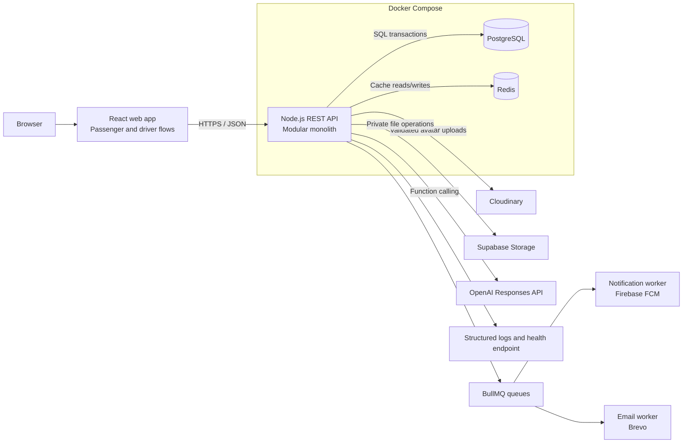
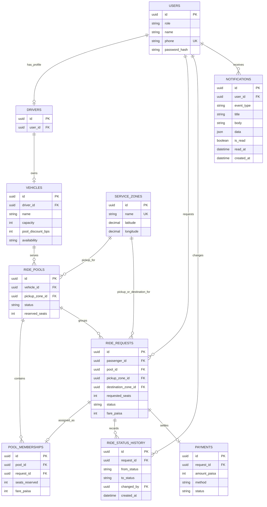

# Dhaka Tesla Pool — MVP Architecture

> This document proposes an implementation design for the requirements in the [project brief](project.md). Requirements in that brief take precedence if the two documents differ.

## Overview

Dhaka Tesla Pool is a ride-pooling MVP for battery-powered three-seat local "Teslas." It helps passengers share compatible trips while keeping each passenger's fare, ride state, and history private. The MVP serves passengers Nasir, Yesmin, Shamim, and Tamim, and driver Riad with vehicle Bullet.

The selected baseline is a **modular monolith**: a React web application, a Node.js REST API, PostgreSQL accessed through Prisma ORM, and Redis for non-authoritative caching. It gives the product one deployable backend and strong relational transactions for capacity claims while keeping cached reads fast.

## Selected technology stack

| Layer | Technology | Role |
| --- | --- | --- |
| Frontend | React | Public browsing, authenticated passenger/driver flows, and API-driven UI state. |
| Backend | Node.js REST API | Authentication, validation, matching, fares, authorization, and ride lifecycle rules. |
| Database | PostgreSQL | Authoritative relational data, constraints, history, and capacity transactions. |
| ORM | Prisma | Typed schema, migrations, and normal database access; explicit transactions/raw SQL are used where row locking is necessary. |
| Cache | Redis | Short-lived cache for read-heavy, non-critical data such as area lists and fare estimates. |
| Email delivery | Brevo API through BullMQ | Sends OTP emails in a retryable email worker; Redis is the source of truth for short-lived OTP state and queue infrastructure. |
| Push notifications | Firebase Cloud Messaging through BullMQ | Sends device notifications in a dedicated notification worker; PostgreSQL stores registered device tokens. |
| Media | Cloudinary | Validated public user-avatar storage and delivery. |
| Logging | Winston | Structured application logs with request and domain context. |
| AI agent | OpenAI Responses API | Natural-language ride assistance through narrowly scoped application tools. |
| Containers | Docker and Docker Compose | Reproducible API, PostgreSQL, and Redis services for local development and deployment. |
| Object storage | Supabase Storage | Private, policy-controlled storage for profile photos, vehicle documents, and future ride attachments. |

## Scope and actors

| Actor | Core responsibilities |
| --- | --- |
| Passenger | Sign up/in; create and cancel a request; see only their own fare, status, and history. |
| Driver | Go online/offline; own a fixed-capacity vehicle; set an applicable pool discount; accept a pool before passengers are matched; mark arrival, start, and completion. |
| Pool / ride | Group compatible requests, reserve seats within vehicle capacity, calculate a per-passenger fare, and retain an audit trail. |

The MVP serves **all Dhaka areas**. It deliberately does not perform live route optimization, charge real payments, or require a commercial map provider. Pickup and destination are selected or searched from a maintained Dhaka-area dataset, with each area stored as a named service zone and representative latitude/longitude.

## System topology



### Responsibilities

- **React web app:** public pages plus authenticated passenger and driver screens, forms, loading/error/empty states, and API integration. It never decides capacity, ownership, fare, or state transitions.
- **Node.js API:** authentication, request validation, authorization, matching, fare calculation, state-machine enforcement, and transaction boundaries. Use Zod schemas to validate every external input—request bodies, route parameters, query strings, headers, cookies, and multipart metadata—before controller business logic runs. Reject unknown, malformed, unsafe, or out-of-range values with a consistent `400` response. Express is used with Multer for multipart uploads. Winston records structured application logs.
- **PostgreSQL with Prisma:** durable relational records, foreign keys, unique constraints, indexes, and row-level locks for capacity-sensitive mutations. Prisma owns schema migrations and normal typed queries; use Prisma interactive transactions with explicit locking/raw SQL where lock semantics need to be unambiguous.
- **Redis:** caches area lists, compatible-area rules, and non-binding fare estimates with short TTLs. It is also the required, authoritative store for short-lived email-verification and password-reset OTPs; PostgreSQL holds no OTP state. Redis must not be the source of truth for vehicle capacity, memberships, request status, fares already quoted, or authorization. Invalidate relevant keys after an area/rule update; PostgreSQL is used whenever a stale read could admit an invalid booking.
- **BullMQ workers:** the API enqueues email and push-notification side effects without waiting for external providers. The email worker uses Brevo; the notification worker uses Firebase Admin and removes invalid FCM tokens from PostgreSQL. Queue retries are bounded and queue failure must not change PostgreSQL ride or authorization decisions.
- **Docker Compose:** starts the API, PostgreSQL, and Redis together, using health checks so the API waits for its dependencies. It is the reproducible local setup and deployment baseline.
- **Supabase Storage:** stores private files rather than relational booking data. The Node.js API is the only component permitted to use the Supabase secret key; React receives only authorized, short-lived signed URLs. Bucket policies remain private by default and object paths, MIME types, and sizes are validated by the API.
- **Cloudinary:** stores validated public user-avatar media. The API accepts only allowlisted image MIME types and configured size limits, stages each upload under `public/assert` using a random server-generated filename, uploads it server-side using Cloudinary credentials, and deletes the staged file in both success and failure paths. PostgreSQL stores only the resulting secure URL. Never expose Cloudinary credentials, accept arbitrary remote URLs, or trust client-provided filenames or media metadata.
- **Ride API Agent:** uses the OpenAI Responses API and function calling to interpret natural-language requests. Its tools call the same authenticated controller actions as HTTP endpoints; it cannot access Prisma, Redis, secrets, or Supabase directly. Capacity, authorization, state transitions, and user confirmation remain application-enforced.

## Domain model



`ride_requests.pool_id` supports efficient lookup; `pool_memberships` is the authoritative membership and per-request allocation record. Enforce one active membership per request with a unique constraint. `payments` is optional for the MVP and may record cash or simulated TeslaPay only.

Useful indexes include active requests by pickup zone/status, pools by vehicle/status, memberships by pool, and status history by request and creation time. Database constraints should require positive seat counts and fares, a vehicle capacity greater than zero, and valid role/status enum values.

## Lifecycle and matching

The request lifecycle is:

```text
REQUESTED → PENDING_DRIVER_ACCEPTANCE → MATCHED → DRIVER_ARRIVED → STARTED → COMPLETED
     └──────────────────────────────────────────────→ CANCELLED
```

A new request is pending until the eligible driver accepts its proposed pool. On acceptance, it becomes `MATCHED` and receives a confirmed fare. A passenger may cancel free of charge before `DRIVER_ARRIVED`; cancellation at or after driver arrival is allowed only before `STARTED` and incurs a 5% cancellation fee. This is the recorded interpretation of the product decision and should be confirmed if the intended cutoff differs.

Pool state is derived or maintained consistently from its members: `OPEN`, `ACCEPTED`, `DRIVER_ARRIVED`, `STARTED`, `COMPLETED`, or `CANCELLED`. Driver actions transition the pool and its active member requests atomically. The API rejects invalid transitions (for example, `REQUESTED → STARTED`).

### Initial matching rule

For a simple, reproducible MVP across all Dhaka areas, a request is proposed to a driver when:

1. its pickup zone is the same;
2. its destination is within the pool's documented route corridor or compatible-destination list; and
3. its requested seats fit the remaining vehicle capacity; and
4. the driver accepts the proposed pool.

Store areas and their coordinates in a versioned service-zone dataset; use a configurable same-pickup radius plus an approved destination-corridor rule, rather than hard-coding a small subset of Dhaka. For the demo, Banani → Mohakhali and Banani → Gulshan 1 are compatible, so Nusrat and Rafiq can ride Bullet together. Shirin can join only if Bullet still has enough seats.

## Fare model

Store money as integer **paisa** (1 BDT = 100 paisa), avoiding floating-point rounding errors. The fare is calculated from the straight-line distance between the selected service-zone coordinates (rounded by a documented rule), until routing data is introduced. A transparent model is:

```text
passenger_fare_paisa = distance_km × 1,000 paisa - driver_pool_discount_paisa
```

The distance charge is **10 BDT (1,000 paisa) per km**. Each driver configures their pool-discount rate, stored as integer basis points on the vehicle (for example, 500 = 5%); the discount is calculated against that passenger's distance charge. Validate a non-negative discount and set a product-defined maximum before release. Calculate and persist the quoted per-passenger fare at matching time; do not recalculate historical fares when configuration changes. The API returns fare only to the owning passenger and authorized driver for their assigned pool.

## Capacity, authorization, and consistency

Capacity is enforced in a single database transaction:

1. Lock the target pool and its vehicle row (`SELECT … FOR UPDATE`).
2. Recalculate active reserved seats from memberships (or verify a guarded counter).
3. Reject if `reserved + requested_seats > vehicle.capacity`.
4. Insert membership, assign the request, calculate its fare, write lifecycle history, and commit.

This means if Nusrat and Shirin both try to reserve Bullet's last seat, only the transaction that holds the lock first can succeed; the second rechecks capacity and receives a conflict response. At larger scale, keep the invariant in the database and add retries for serialization failures—not a client-side availability check.

Anyone may browse the public site without an account. Creating, viewing, changing, or cancelling a ride request requires a short-lived stateless JWT; every protected endpoint derives the actor identity from the credential, not request body fields. Logout and password changes cannot revoke an already-issued token, so access-token expiry must remain short. Passengers can read/change only their own request before the cancellation cutoff; drivers can act only on their own vehicle's pools; administrators, if added, require a separate role. Validate every external input with Zod server-side before it is used, including request bodies, path parameters, query strings, headers, cookies, and multipart metadata. Validation schemas must be strict by default and return predictable validation, authorization, conflict, and state-transition errors.

## API boundary

REST is recommended because the resources and lifecycle actions are small and explicit. Representative routes:

- `POST /auth/register`, `POST /auth/login`
- `GET /areas`, `GET /fare-estimates`, `POST /ride-requests`, `GET /ride-requests/me`, `POST /ride-requests/:id/cancel`
- `GET /driver/pools`, `POST /pools/:id/accept`, `POST /pools/:id/arrive`, `POST /pools/:id/start`, `POST /pools/:id/complete`

The API owns all business rules; browser pages are clients of these contracts.

## Backend project structure

The backend follows a versioned, feature-oriented API layout. The examples below use TypeScript (`.ts`) because the selected backend is TypeScript; each feature keeps its controllers, class-based repository, routes, validation, and model together. There is no service layer: controllers contain the feature's business logic. Controllers are kept in a feature-level `controllers/` folder, and every registered route action has its own controller file.

```text
src/
├── app.ts
├── server.ts
├── config/
│   ├── db.ts
│   └── env.ts
├── api/
│   └── v1/
│       ├── users/
│       │   ├── controllers/
│       │   │   ├── create-user.controller.ts
│       │   │   ├── get-user.controller.ts
│       │   │   └── update-user.controller.ts
│       │   ├── user.repository.ts
│       │   ├── user.routes.ts
│       │   ├── user.validation.ts
│       ├── vehicles/
│       ├── ride-requests/
│       └── pools/
├── middleware/
│   ├── auth.middleware.ts
│   ├── error.middleware.ts
│   └── validate.middleware.ts
├── jobs/
│   ├── queues.ts
│   └── workers/
├── lib/
│   ├── prisma.ts
│   ├── redis.ts
│   └── supabase.ts
├── shared/
│   ├── constants/
│   ├── helpers/
│   └── utils/
└── tests/
```

Controllers translate HTTP requests and responses and contain business rules; repositories are class-based and are the only layer that reads or writes PostgreSQL. A route module imports its controller from the feature's `controllers/` folder, and each registered route action maps to one separate controller file—for example, `POST /users` maps to `controllers/create-user.controller.ts`. Each feature defines Zod validation schemas in its `*.validation.ts` file, and routes or validation middleware parse every external input before invoking a controller. Controllers may only receive validated, typed data: controller files MUST NOT define Zod schemas, call `parse` or `safeParse`, inspect raw request input for validation, or contain any other input-validation code. Multipart endpoints use Multer memory storage with explicit file-count, field-count, size, and MIME-type limits before Cloudinary upload; validation modules validate parsed text fields and normalized upload metadata with Zod before the controller runs. Email delivery is a direct Brevo side effect and does not make capacity or lifecycle decisions.

## MVP quality baseline

- Test that capacity cannot be exceeded, including two near-simultaneous claims.
- Test driver acceptance before matching, rejected lifecycle transitions, the 5% late-cancellation fee, ownership checks, and Nusrat/Rafiq fare calculations at 10 BDT/km.
- Winston logs request ID, authenticated actor, pool ID, state transition, queue-job failure, and transaction failure without logging secrets or password hashes.
- Use password hashing, HTTPS in deployment, environment-provided secrets, rate limits on authentication, strict Zod validation for every external input, and an authenticated health/readiness strategy.
- Keep `SUPABASE_SECRET_KEY` only in the API environment; never commit it or send it to React. Use a dedicated private bucket and signed URLs for retrieval.
- Provide Docker Compose, migrations, `.env.example`, and seed data for Jashim, Bullet, Nusrat, Rafiq, and Shirin as required by the [project brief](project.md).

## Trade-offs and future scale (non-binding)

This design favors explainability and relational correctness over sophisticated routing or real-time push updates. PostgreSQL and a modular API remain appropriate for the MVP; Redis is deliberately limited to cacheable reads and a lightweight polling UI is enough initially.

If adoption approaches 1M passengers and 100k drivers, evolve incrementally: stateless API replicas behind a load balancer, targeted indexes and read replicas, Redis-backed cached reference reads, a geospatial index for matching, idempotency keys for writes, and centralized metrics/tracing. Partition high-volume history when evidence requires it. These are future options, not MVP dependencies; microservices, Kafka, and Kubernetes are intentionally not mandated now.

## Decisions to confirm

The following are safe MVP defaults, but should be confirmed before implementation:

1. the authoritative all-Dhaka area dataset and the pickup-radius / route-corridor thresholds;
2. the maximum driver-discount percentage and whether it is set per vehicle or per trip;
3. whether a pool is automatically proposed on the first request or created by a driver before acceptance;
4. whether the 5% fee applies from `DRIVER_ARRIVED` onward (the current interpretation); and
5. the initial authentication credential type and deployment target.
# User-profile deletion

`/api/v1/users/me` is an authenticated self-service resource. Account deletion is password-confirmed and transactionally rejects active passenger rides and driver pools. Historical completed/cancelled requests retain fare and lifecycle data while their passenger reference, status actor reference, and driver account reference are set to null; no live user account or profile data remains. Avatar cleanup is post-commit and logged for remediation if Cloudinary is unavailable.
